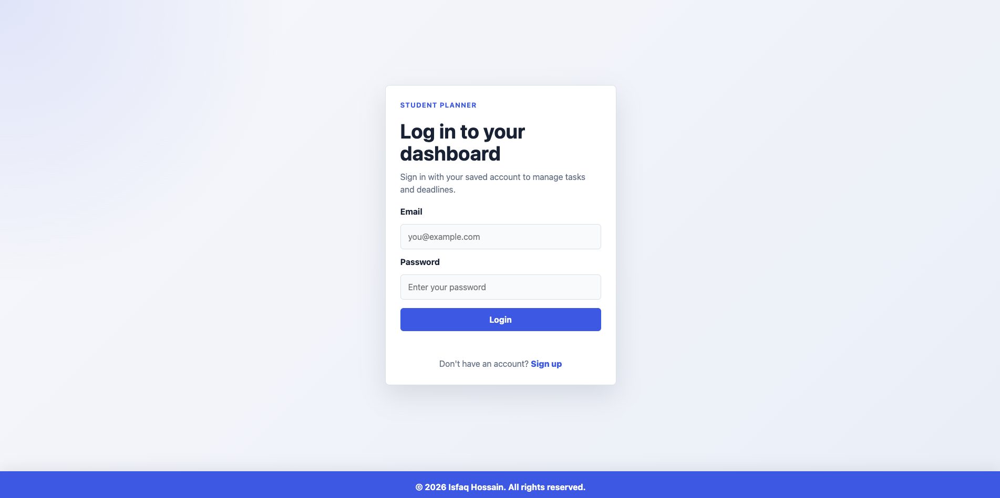
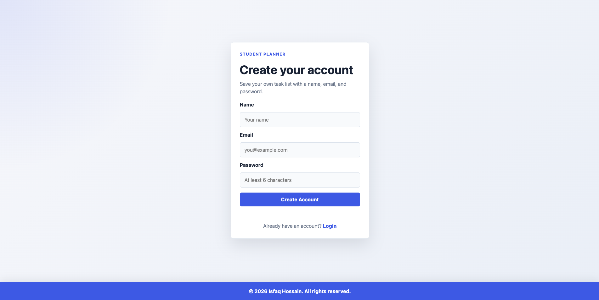

# Student Task Manager Version 2

A warm, responsive student task manager built with HTML, CSS, and vanilla JavaScript. The app helps students create accounts, manage user-specific tasks, track deadlines, organize subtasks, and keep a clean personal dashboard.

## Features

- Signup with name, email, password, and account creation date
- Login, logout, dashboard protection, and user-specific task storage
- Dashboard profile section with editable name
- Add, edit, delete, and complete tasks
- Optional task description/notes
- Subtasks/checklist items with progress counts
- Priority, category, due date, countdown timer, overdue status, and 24-hour warnings
- Browser notifications for deadline alerts
- Existing search bar preserved and expanded to search titles, notes, subtasks, category, and priority
- Status filters: All, Pending, Completed
- Category filter
- Sort dropdown with newest, oldest, deadline, priority, pending, and completed options
- Summary cards for total, completed, pending, overdue, deadline soon, and high priority tasks
- Light and dark mode with saved theme preference
- `localStorage` data persistence
- Sticky footer and responsive layout

## Theme

Version 2 replaces the previous blue theme with a soft orange and off-white color system.

- Background: warm light cream/off-white
- Cards and forms: soft warm neutral surfaces
- Main accent: muted professional orange
- Hover states: slightly deeper orange
- Text: dark charcoal/navy for readability
- Error: soft red
- Success: soft green
- Warning: readable amber/orange
- Dark mode: dark warm neutrals with the same orange accent

The theme is applied consistently across login, signup, dashboard, buttons, filters, badges, task cards, summary cards, profile cards, footer, and form inputs.

## Technologies Used

- HTML5
- CSS3
- Vanilla JavaScript
- Browser `localStorage`
- Browser Notification API

No backend, database, framework, or external library is required.

## File Structure

```text
student-task-manager/
├── index.html              # Redirects to login.html
├── login.html              # Login page
├── signup.html             # Signup page
├── dashboard.html          # Main task manager dashboard
├── style.css               # Shared light/dark theme and responsive styling
├── script.js               # Authentication, tasks, filters, sorting, profile, and theme logic
├── README.md               # Project documentation
├── TECHNICAL_NOTES.md      # Technical explanation and interview notes
└── screenshots/            # Project screenshots
```

## Screenshots

### Login Page


### Signup Page


### Dashboard Page

Refresh or add a new dashboard screenshot after capturing the Version 2 dashboard.

## How to Run the Project

1. Download or clone this repository.
2. Open `index.html` or `login.html` in a browser.
3. Click Sign up to create an account.
4. Login using the created email and password.
5. Manage tasks from `dashboard.html`.

Because the project is fully front-end, opening the HTML files directly is enough.

## Live Demo

Add your live project link here after deploying the site.

```text
https://your-username.github.io/student-task-manager/
```

## Future Improvements

- Add password confirmation during signup
- Add export/import for task data
- Add recurring tasks
- Add drag-and-drop task ordering
- Add more category options
- Add a secure backend for real authentication
