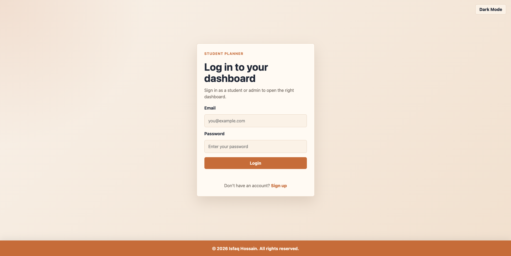
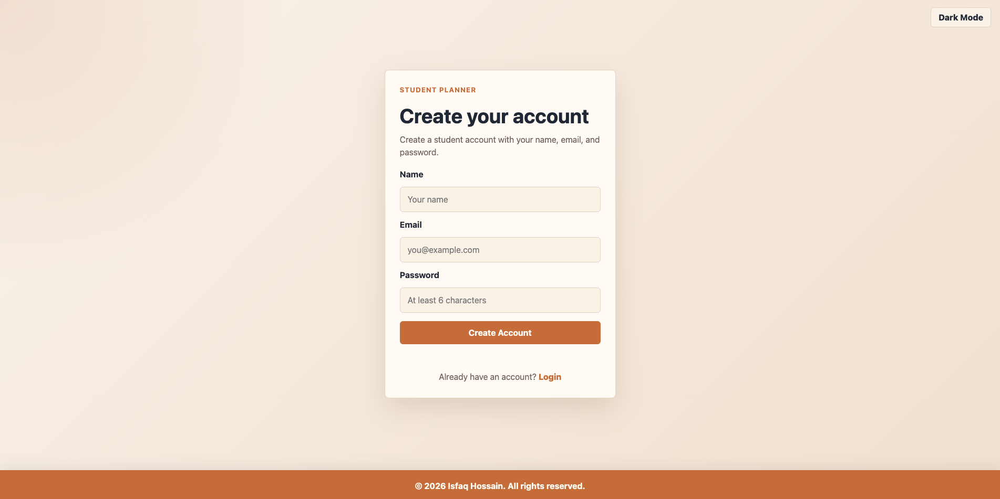
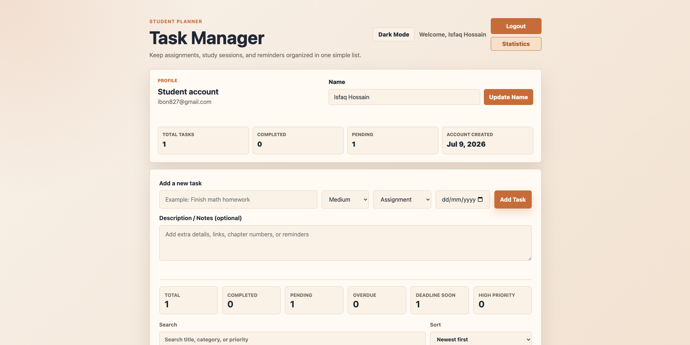
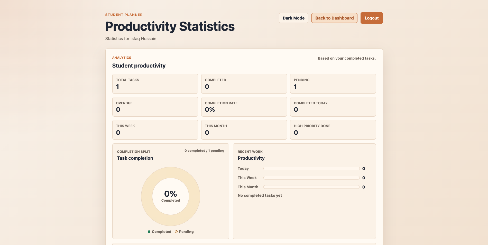
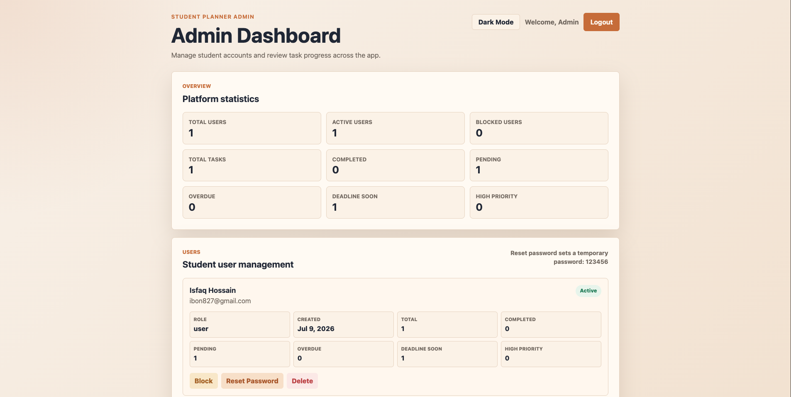
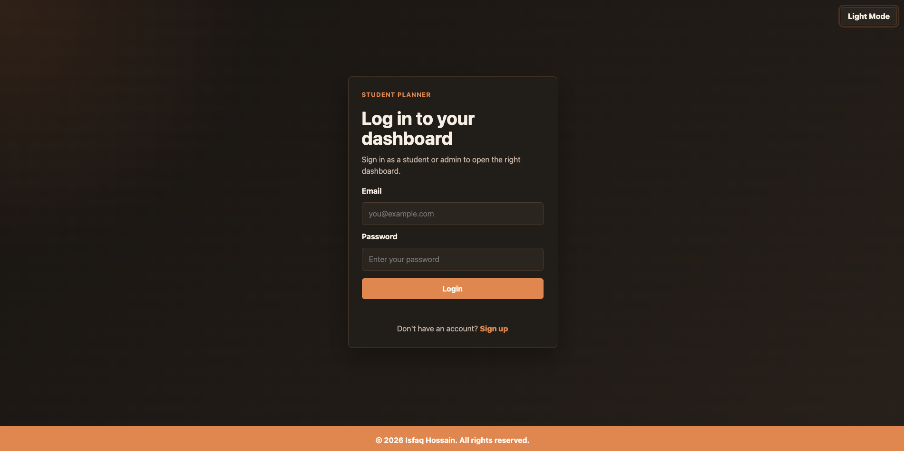

# Student Task Manager Version 3

A warm, responsive student task manager built with HTML, CSS, and vanilla JavaScript. The app now supports role-based login, a student dashboard with progress statistics, and an admin dashboard for demo user management.

## Features

- Signup with name, email, password, account creation date, and default `user` role
- Role-based login for students and admin
- Default admin account created once in `localStorage`
- Student dashboard protection and admin dashboard protection
- Separate student statistics page at `statistics.html`
- User-specific task storage
- Editable student profile name
- Add, edit, delete, and complete tasks
- Optional task description/notes
- Subtasks/checklist items with progress counts
- Priority, category, due date, countdown timer, overdue status, and 24-hour warnings
- Browser notifications for deadline alerts
- Existing search bar preserved and expanded to search titles, notes, subtasks, category, and priority
- Status filters, category filter, and sort dropdown
- Student progress statistics with completion rate and productivity insights on a separate page
- Visual student progress analytics panel on `statistics.html`
- Completion donut chart for completed vs pending tasks
- Category progress bars for completed tasks by category
- Productivity bar graph for tasks completed today, this week, and this month
- Category-wise completed task progress
- Admin summary cards across all student users
- Admin user management: block, unblock, delete, and reset password
- Admin activity log saved in `localStorage`
- Light and dark mode with saved theme preference
- Sticky footer and responsive layout

## Default Admin Login

```text
Email: admin@studenttask.com
Password: admin123
```

The default admin is added only if it does not already exist.

## Student Progress Statistics

The student dashboard stays focused on task management. A `Statistics` button opens `statistics.html`, which shows:

- Total, completed, pending, and overdue tasks
- Completion rate percentage
- A CSS donut chart for completed vs pending tasks
- Productivity bars for today, this week, and this month
- Tasks completed today, this week, and this month
- High priority tasks completed
- Category-wise completed task counts as horizontal progress bars
- Most productive day/month/year calculations are kept in code for future analytics, but the dashboard no longer shows separate cards for them.

Completion statistics use the `completedAt` timestamp saved when a task is marked completed.

## Admin Dashboard

The admin dashboard shows:

- Total users, active users, and blocked users
- Total, completed, pending, overdue, deadline soon, and high priority tasks across all student users
- A responsive user management list for all normal student accounts
- Recent admin activity logs

Admin actions:

- Block user
- Unblock user
- Delete user and that user's task data
- Reset password to `123456`

The default admin account is protected from dangerous actions.

## Theme

The project uses a soft orange and off-white color system.

- Background: warm light cream/off-white
- Cards and forms: soft warm neutral surfaces
- Main accent: muted professional orange
- Hover states: slightly deeper orange
- Text: dark charcoal/navy for readability
- Error: soft red
- Success: soft green
- Warning: readable amber/orange
- Dark mode: dark warm neutrals with the same orange accent

The theme is applied consistently across login, signup, student dashboard, admin dashboard, buttons, filters, badges, cards, footer, and form inputs.

## Technologies Used

- HTML5
- CSS3
- Vanilla JavaScript
- Browser `localStorage`
- Browser Notification API

No backend, database, framework, or external library is required.

## File Structure

```text
student-task-manager/
├── index.html              # Redirects to login.html
├── login.html              # Shared login page for students and admin
├── signup.html             # Student signup page
├── dashboard.html          # Student task management dashboard
├── statistics.html         # Student productivity analytics page
├── admin.html              # Admin dashboard and user management
├── style.css               # Shared theme, layout, and responsive styling
├── script.js               # Authentication, tasks, admin, stats, and theme logic
├── README.md               # Project documentation
├── TECHNICAL_NOTES.md      # Technical explanation and interview notes
└── screenshots/            # Project screenshots
```

## Screenshots

### Login Page


### Signup Page


### Student Dashboard


### Student Productivity Statistics Page


### Admin Dashboard


### Dark Mode


## How to Run the Project

1. Download or clone this repository.
2. Open `index.html` or `login.html` in a browser.
3. Sign up as a student, or log in with the default admin credentials.
4. Student accounts go to `dashboard.html`.
5. Admin accounts go to `admin.html`.
6. From the student dashboard, click Statistics to open `statistics.html`.

Because the project is fully front-end, opening the HTML files directly is enough.

## Live Demo

Add your live project link here after deploying the site.

```text
https://your-username.github.io/student-task-manager/
```

## Future Improvements

- Add password confirmation during signup
- Add export/import for task data
- Add recurring tasks
- Add drag-and-drop task ordering
- Add admin search/filter tools
- Add a secure backend for real authentication
