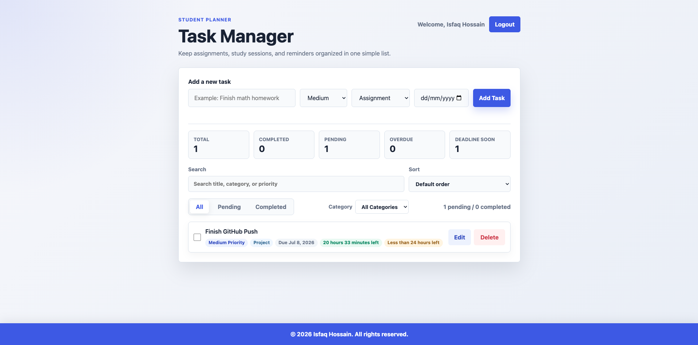

# Student Task Manager

A clean, responsive student task manager built with HTML, CSS, and vanilla JavaScript. The app helps students create accounts, manage personal tasks, track due dates, filter work, and stay aware of upcoming deadlines.

## Features

- Signup with name, email, and password
- Login using registered email and password
- User-specific task storage
- Dashboard welcome message with username
- Add, edit, delete, and complete tasks
- Priority, category, and due date
- Countdown timer and deadline warning
- Browser notification for deadline alerts
- Filter tasks by status and category
- `localStorage`-based data persistence
- Responsive UI
- Sticky footer

## Technologies Used

- HTML5
- CSS3
- Vanilla JavaScript
- Browser `localStorage`
- Browser Notification API

## File Structure

```text
student-task-manager/
├── index.html              # Redirects to login.html
├── login.html              # Login page
├── signup.html             # Signup page
├── dashboard.html          # Main task manager dashboard
├── style.css               # Styling for all pages
├── script.js               # Authentication and task manager logic
├── README.md               # Project documentation
├── TECHNICAL_NOTES.md      # Technical explanation and interview notes
└── .gitignore
```

## Screenshots

### Login Page


### Signup Page


### Dashboard Page


## How to Run the Project

1. Download or clone this repository.
2. Open `index.html` or `login.html` in the browser.
3. Click Sign up to create an account.
4. Login using the created email and password.
5. After successful login, the user is redirected to `dashboard.html`.

No backend, database, framework, or external library is required.

## Live Demo

Add your live project link here after deploying the site.

Example:

```text
https://your-username.github.io/student-task-manager/
```

## Future Improvements

- Add password confirmation during signup
- Add task notes or descriptions
- Add recurring tasks
- Add light and dark theme support
- Add export/import for task data
- Improve accessibility with more keyboard-friendly controls
